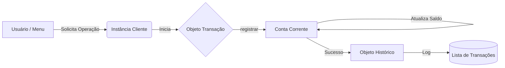

# 1. 🏦 Sistema Bancário em Python - Arquitetura Orientada a Objetos & Clean Code

# 2. Resumo Introdutório

Este projeto representa a evolução estratégica de um script de automação bancária simples para uma arquitetura de software robusta, baseada nos paradigmas da Programação Orientada a Objetos (POO). A refatoração transformou uma execução procedural e imperativa em um sistema modular, onde regras de negócio são encapsuladas em classes de domínio, garantindo maior manutenibilidade, escalabilidade e segurança na manipulação de dados sensíveis como saldos e históricos de transações.

# 3. 🚀 Evolução Técnica

Esta seção detalha a transição técnica, contrastando as limitações da versão anterior com as soluções de engenharia aplicadas na versão atual.

### 📉 De: Ponto Inicial (Paradigma Procedural)

* **Obsessão por Primitivos:** Utilização excessiva de dicionários genéricos (`dict`) para representar entidades complexas (Clientes e Contas), resultando em fragilidade nos dados.
* **Acoplamento Forte e Lógica Monolítica:** Regras de validação de saque e depósito misturadas diretamente com a interface de usuário (`print`/`input`), dificultando testes e reutilização.
* **Ausência de Encapsulamento:** O saldo da conta era acessível e modificável diretamente por qualquer parte do código, violando princípios básicos de segurança.
* **Redundância de Código:** Repetição de lógica de registro de histórico para cada operação financeira.

### 📈 Para: Transformação Aplicada (Arquitetura POO)

A nova arquitetura adota princípios SOLID e padrões de projeto para resolver os débitos técnicos listados acima.

#### 1. Abstração e Interfaces (Módulo `abc`)

Implementamos a classe abstrata `Transacao` para definir um contrato estrito. Isso permite que o sistema trate `Saque` e `Deposito` polimorficamente, facilitando a adição de futuras operações (ex: Transferência) sem quebrar o código existente.

```python
from abc import ABC, abstractmethod

class Transacao(ABC):
    @abstractmethod
    def registrar(self, conta):
        pass

```

* **Vantagem Técnica:** Garante que qualquer nova transação implemente obrigatoriamente o método `registrar`, prevenindo erros em tempo de execução.

#### 2. Encapsulamento e Proteção de Dados

Substituímos o acesso direto a variáveis por **Properties**. O atributo `_saldo` é protegido (convenção *protected*), e sua modificação ocorre apenas através de métodos controlados que validam as regras de negócio.

```python
@property
def saldo(self):
    return self._saldo

# O saldo só é alterado se passar pelas validações de 'sacar' ou 'depositar'
def sacar(self, valor):
    if valor > self.saldo:
        return False
    self._saldo -= valor
    return True

```

#### 3. Herança e Especialização

Utilizamos herança (`ContaCorrente(Conta)`) para estender funcionalidades base. A classe `ContaCorrente` reutiliza a lógica de `Conta` via `super()`, mas adiciona camadas específicas de validação (limites de saque), mantendo o princípio DRY (*Don't Repeat Yourself*).

#### 4. Composição (Histórico)

Em vez de strings concatenadas, adotamos a **Composição**. A classe `Conta` *tem um* `Historico`. Isso estrutura os dados de transação como objetos, permitindo futura manipulação analítica (ex: filtrar extrato por data), o que era impossível na versão anterior.

# 4. 🏗️ Arquitetura do Sistema

A arquitetura separa a camada de **Domínio** (Regras de Negócio) da camada de **Controle** (Interface/Menu).

### Fluxo de Dados

O diagrama abaixo ilustra o fluxo lógico de uma operação financeira, demonstrando como o `Cliente` orquestra a interação entre a `Transacao` e a `Conta`.


